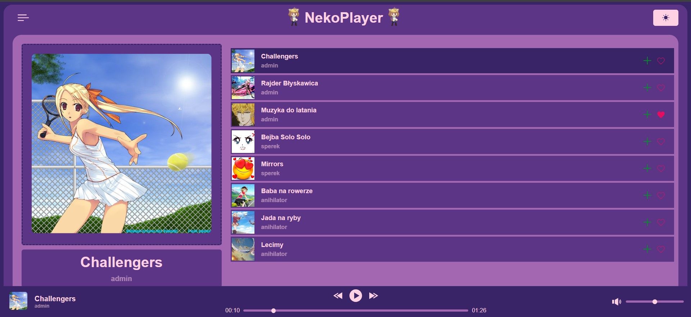
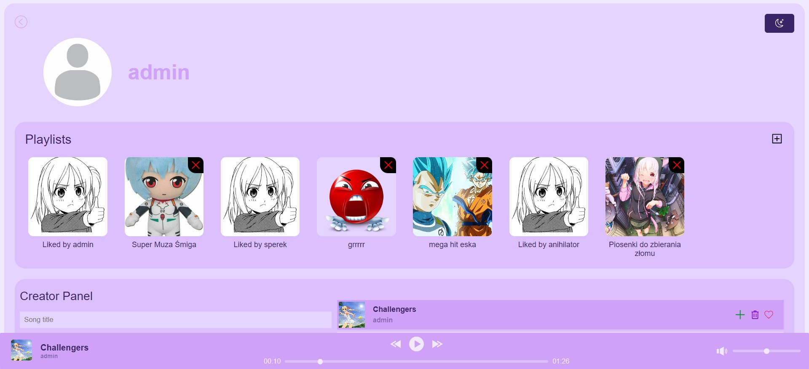
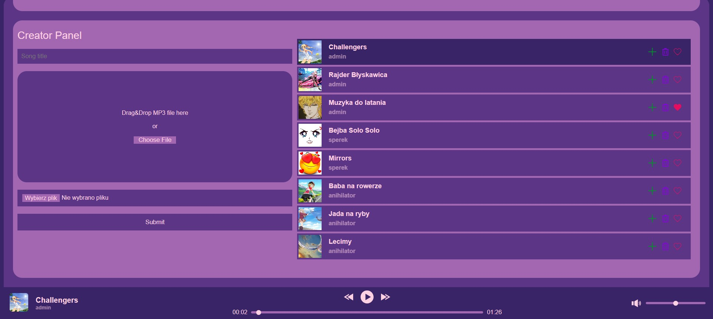

# NekoPlayer-Frontend

## Table of contents

* [Description](#description)
* [Technologies](#technologies)
* [How the Application Works](#how-the-application-works)
* [Screenshots](#screenshots)

## Description

This project is the frontend part of a university project focusing on a music player application named NekoNotes. I created it with my friend and worked on the Profile and Settings page as well as the Playbar, CreatorPanel, AddSong and Song component.
You can find the backend [here](https://github.com/LeBulbasaur/NekoPlayer-Server)!

## Technologies

- React
- Javascript
- HTML
- CSS
- RESTful API (for backend communication)

## How the Application Works

Neko Player is designed to provide a seamless music streaming experience. Here's a simple overview of how the application works:

1. **User Authentication**:

   - Users can sign up or log in using the `Signup.js` and `Login.js` components. Upon successful authentication, a token is stored in localStorage for session management.

2. **Global State Management**:

   - The application uses React's Context API and the `useReducer` hook for global state management of the currently playing song. The state and dispatcher are provided through `AppContext.js`.

3. **Navigation and Routing**:

   - `App.js` sets up the main routes for the application using `react-router-dom`. It defines routes for the main pages like Signup, Login, Profile, Main, Settings, and Playlists.

4. **Displaying Songs and Playlists**:

   - The `Main.js` component displays all available songs. Users can navigate to specific playlists using the `Playlists.js` component, which shows songs within that playlist.
   - The `Song.js` component is used to display individual song details and controls.

5. **Playing Music**:

   - The `Playbar.js` component provides controls for playing, pausing, skipping songs, and adjusting the volume. It fetches the song file and updates the audio source accordingly.

6. **Managing Songs and Playlists**:

   - Users can add new songs using the `AddSong.js` component, which allows file uploads for song files and cover images.
   - The `CreatorPanel.js` component lets users manage their uploaded songs.
   - The `Playlist.js` component allows users to create, delete, and manage playlists.

7. **User Settings**:

   - The `Settings.js` component lets users update their profile information, including changing their username, password, and profile picture.

8. **Theming**:
   - The `Theme.js` component handles switching between light and dark modes, storing the user's preference in localStorage.

## Screenshots

